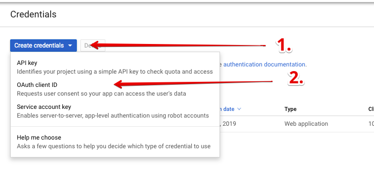
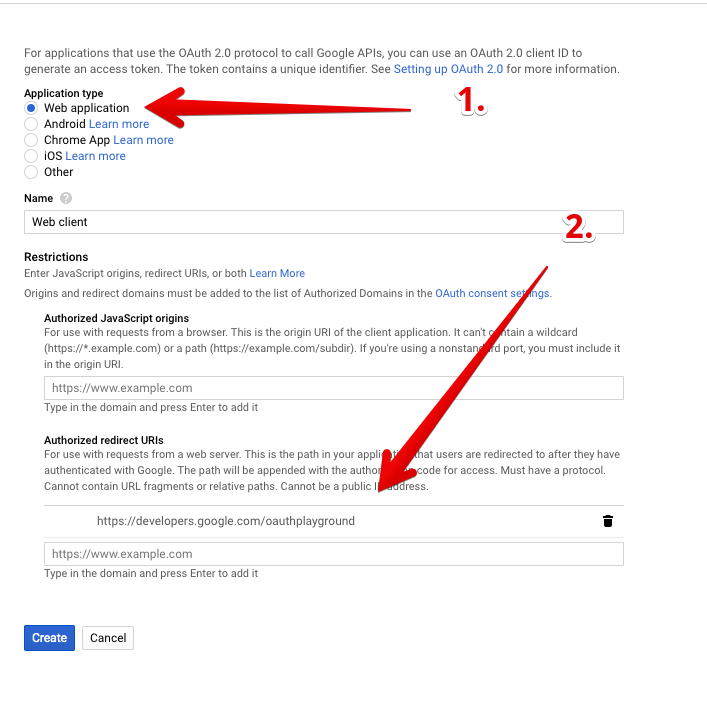
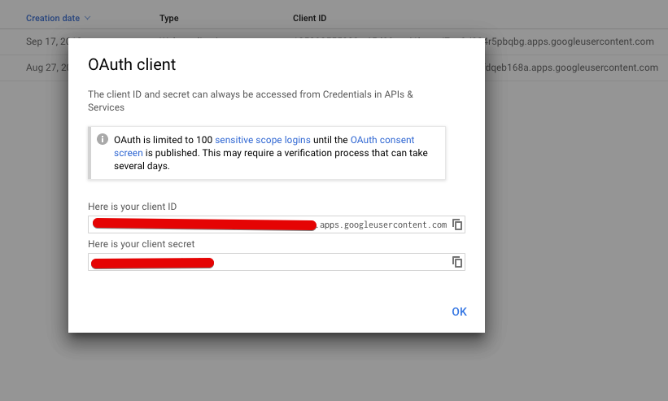
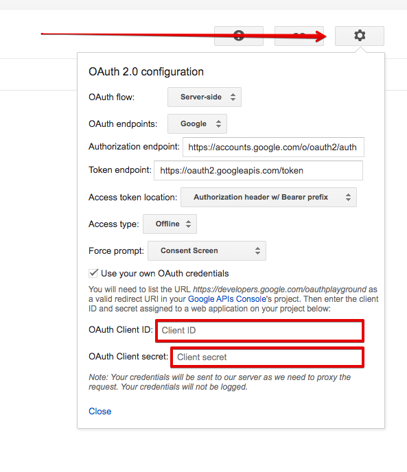
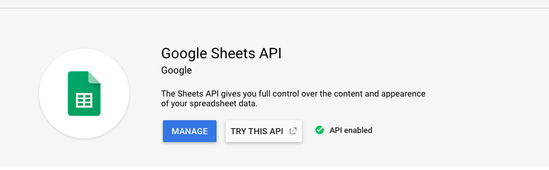
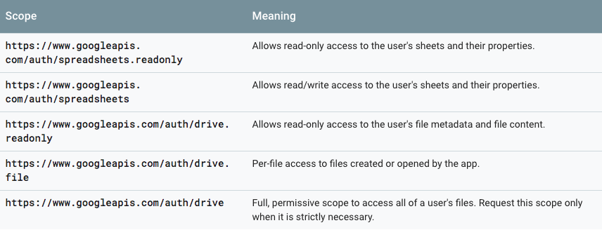
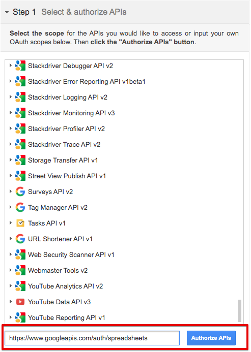
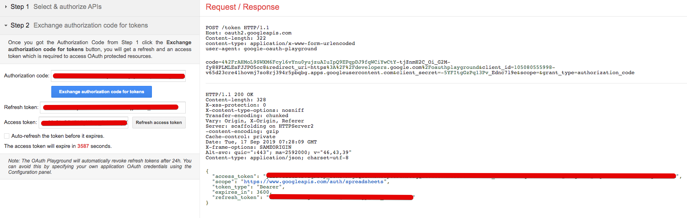

# Google OAuth 2.0

## Create application

1. Go to [Google Console](https://console.developers.google.com/apis/credentials)
and create credentials.  

    

2. Chose "Web application" type 
& fill "https://developers.google.com/oauthplayground" to field "Authorized redirect URIs"

    

3. Save your client ID & secret key.

    

## Get Access & Refresh tokens

Go to [OAuth 2.0 Playground](https://developers.google.com/oauthplayground/#step1&scopes=https%3A//www.googleapis.com/auth/adwords&url=https%3A//&content_type=application/json&http_method=GET&useDefaultOauthCred=checked&oauthEndpointSelect=Google&oauthAuthEndpointValue=https%3A//accounts.google.com/o/oauth2/auth&oauthTokenEndpointValue=https%3A//oauth2.googleapis.com/token&includeCredentials=unchecked&accessTokenType=bearer&autoRefreshToken=unchecked&accessType=offline&forceAprovalPrompt=checked&response_type=code).

1. Fill client ID & client secret fields in OAuth 2.0 configuration form.

    
    
2. Select & Authorize API  
    URL for Authorize API you can find in [Library](https://console.developers.google.com/apis/library)

    For example Google Sheets API:
    

    Scopes for API authorizations you can find on selected API documentation
    https://developers.google.com/sheets/api/guides/authorizing
    
    
    

3. Exchange authorization code for tokens

    After you can get authorization code & you can click "Exchange authorization code for tokens" button

    Congratulations! You are getting the refresh token!
    
    